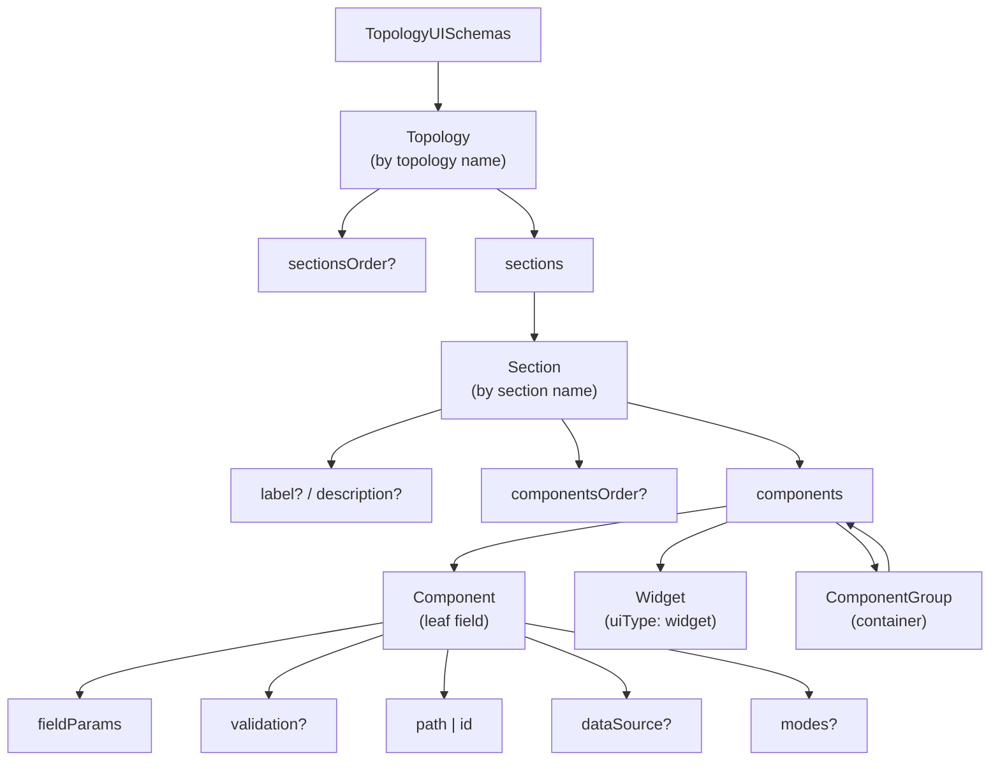
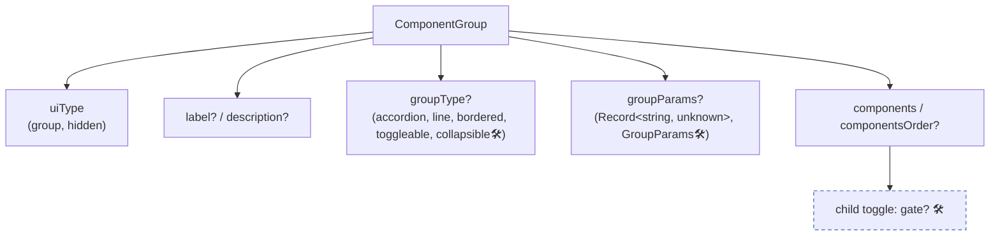
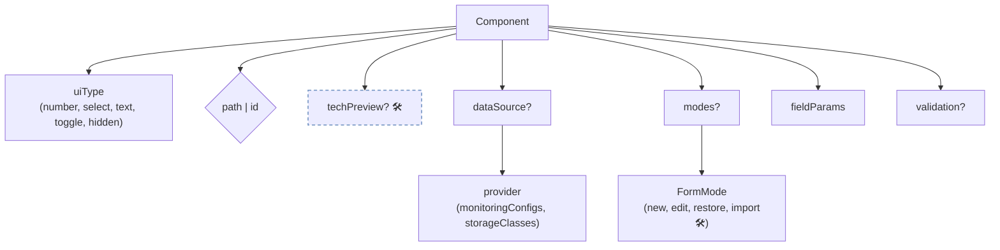
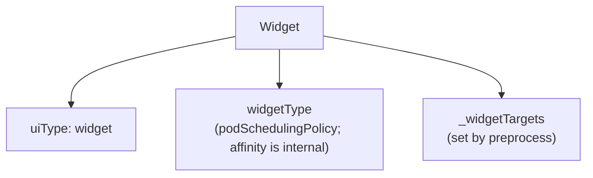
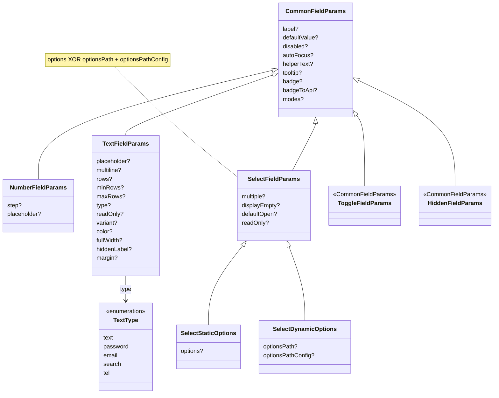
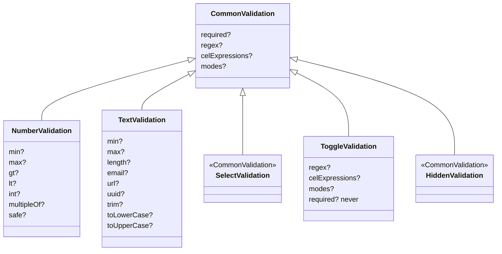

# UI Generator — Schema Reference (props tree)

> Schema props are defined in `ui-generator.types.ts`.
> **Legend:** no marker means implemented; `🛠️` means planned / not implemented yet. In flowcharts, non-implemented nodes also use a dashed border.

Read the diagrams top-down: topology → sections → components (leaf fields) / groups (containers) → their params.

## Overview Map

## Level 2 — ComponentGroup (container)

`gate` 🛠️ is a flag on a child `toggle` (part of the group-kernel proposal, tracked separately).

## Level 2 — Component (leaf field)

- **`path` | `id`** — `path` (`string` | `string[]`) writes to the API; an array is a multi-path (`[0]` is the source, all entries are targets). `id` has no API binding and is used only for validation / CEL.
- **`dataSource.provider`** — a key in the open runtime registry (`register()`), not a closed enum.
- **`modes?`** — `{ [FormMode]: { uiType? } }`; `import` is declared in the enum but is not used by the code.

## Level 2 — Widget (host-rendered leaf)

- **Supported props:** `uiType: widget` and `widgetType`.
- **`widgetType`** selects the renderer from the consumer's `WidgetRegistry` (edit) and
  `WidgetSummaryRegistry` (`label` + `View` + `digest` for the overview and wizard preview).
  Unknown types render nothing.
- **Location is defined per widget type** — a widget is unique, so there is no shared rule
  for where its data lives:
  - `affinity` (internal) binds one `path`, like a field.
  - `podSchedulingPolicy` is placed without `path` / `id`: preprocess resolves the paths it
    writes per provider and topology (`widgetTargetResolvers`) into `_widgetTargets`, which
    toggleable groups, payload merging and the overview read.

## Level 3 — fieldParams (by field type)

## Level 3 — validation (by field type, mode-aware)

- **modes (mode-aware)** — `{ [FormMode]: <same rules> + inheritShared? }`.
- **`toggle`** — `required` is always optional (`never`).
- **`select` / `hidden`** — common rules only.

## Cross-Cutting Concepts

| Concept                        | Meaning                                                                                                                                                                                                                          | Status      |
| ------------------------------ | -------------------------------------------------------------------------------------------------------------------------------------------------------------------------------------------------------------------------------- | ----------- |
| **FormMode**                   | `new · edit · restore · import` controls `modes` at three levels: component `uiType`, `fieldParams`, and `validation`                                                                                                            | implemented |
| **multi-path**                 | `path: [a, b]` writes the same value to all targets                                                                                                                                                                              | implemented |
| **dataSource / API providers** | `dataSource: { provider }` names an API-backed option source; preprocess dev-validates the provider key, and at runtime `DataSourceField` loads the options through the registry (`DataSourcePrefetcher` sets defaults on mount) | implemented |
| **CEL validation**             | Cross-field validation rules declared via `celExpressions` (with an `original` namespace available in edit mode)                                                                                                                 | implemented |
| **CEL conditional rendering**  | Show / hide fields based on another field value through a generic mechanism                                                                                                                                                      | 🛠️          |
| **group kernel**               | `bordered`, `toggleable` (form-only switch); planned: `collapsible`, persisted `gate` ([#3290](https://github.com/openeverest/openeverest/issues/3290)), `direction`                                                             | partial     |

## To Consider

- **Disabling a group (including a toggleable switch)** — covered by group-level `modes` (`hidden` / `disabled` per form mode) in [#3080](https://github.com/openeverest/openeverest/issues/3080). Conditional disabling via CEL depends on [#1837](https://github.com/openeverest/openeverest/issues/1837).
- **`fieldParams.badge` / `badgeToApi`** — currently inherited by all field types through `CommonFieldParams`; visual badge rendering is supported for `number` and `select`, while `text` / `toggle` / `hidden` have asymmetric behavior.

  When `badgeToApi` is set, the badge also acts as the value's **unit**: applied on write and converted back on read by `stripBadgeFromValue` (`badge-to-api`), which the overview cards reuse for display. The unit semantics, conversion rules and supported-unit list are documented for users in [number-field](../../ui-generator/components/number-field.md#unit-badge).

## Metadata

- Owner: UI
- Status: current
- Last updated: 2026-09-30
