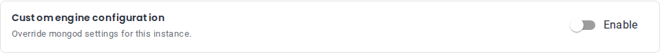

# Groups

Groups allow you to organize multiple fields together with different layout options.

## Table of Contents

- [Line Group](#line-group)
- [Accordion Group](#accordion-group)
- [Bordered Group](#bordered-group)
- [Toggleable Group](#toggleable-group)

Related: [Number Field](components/number-field.md), [Select Field](components/select-field.md), [Text Field](components/text-field.md), [Validation](validation.md)

## Line Group

//TODO will be renamed, documentation should be checked before merging
Displays components in a horizontal line (flex layout).

```yaml
resourceGroup:
  uiType: group
  groupType: line
  label: Resources
  components:
    cpu: { ... }
    memory: { ... }
    disk: { ... }
  componentsOrder:
    - cpu
    - memory
    - disk
```

//TODO visual example

## Accordion Group

Displays components in a collapsible accordion panel.

```yaml
advancedSettings:
  uiType: group
  groupType: accordion
  label: Advanced Settings
  description: Optional advanced configuration
  components:
    setting1: { ... }
    setting2: { ... }
```

//TODO visual example

## Bordered Group

A static bordered card around related fields. Visual only: it doesn't change where the fields are saved.

- `label` and `description` are optional. Omit both for a plain box without a heading.
- Can contain other groups, e.g. a `line` group.

```yaml
storage:
  uiType: group
  groupType: bordered
  label: Storage
  description: Defines the type and performance of storage for your instance.
  components:
    storageClass:
      uiType: text
      path: spec.components.engine.storage.class
      fieldParams:
        label: Storage class
  componentsOrder:
    - storageClass
```


## Toggleable Group

A bordered card with an **Enable** switch, for optional settings the user turns on or off as a whole. The switch exists only in the form and is not sent to the API.

```yaml
customConfig:
  uiType: group
  groupType: toggleable
  label: Custom engine configuration
  description: Override mongod settings for this instance.
  components:
    configuration:
      uiType: text
      path: spec.components.engine.parameters.configuration
      fieldParams:
        label: Engine configuration
        multiline: true
      validation:
        required: true
  componentsOrder:
    - configuration
```




**Behavior**

- **Off:** the fields are hidden, not validated and not sent to the API. On an existing instance, turning the group off removes its saved values.
- **Initial state:** off for a new instance. On if the instance, preset or restored backup already has a value in any of the group's fields (`false` and `0` count). Default values from the schema don't turn it on.
- **Options:** selects with a `dataSource` inside the group load their options only while the group is on.
- **Topology switch:** if the new topology has the same group (same section and group key), the switch keeps its state; otherwise it starts off.

**Rules** — if one is broken, the group is shown as a bordered group without a switch:

- At least one field in the group has a `path`.
- No field outside the group uses the same `path`.
- A toggleable group is not nested in another toggleable group.
- Section and group keys contain only letters, digits, `_` and `-`.

**Keep in mind**

- While the group is off, its fields are unset — CEL rules see them that way too. If a rule on a field **outside** the group reads one of them, check it with `has()` first:
  `!has(spec.monitoring.interval) || spec.backup.retention >= spec.monitoring.interval`
- Don't put fields that can't be changed after creation (read-only in edit mode) inside the group: turning it off would delete them.

**Current limitations**

- The switch is always active: it can't be hidden or disabled per form mode yet — [#3080](https://github.com/openeverest/openeverest/issues/3080).
- Section and group keys are limited to letters, digits, `_` and `-` until [#3221](https://github.com/openeverest/openeverest/issues/3221).
- Backup, schedule and PITR forms don't support toggleable groups yet; there the group is shown as a bordered group — [#3268](https://github.com/openeverest/openeverest/issues/3268).
