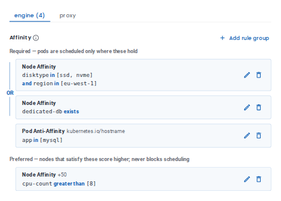
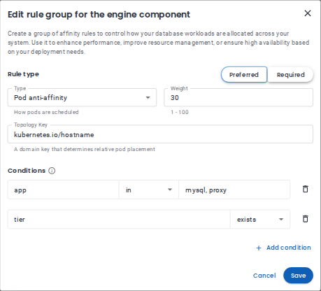

# Widgets

A **widget** is a component the application renders itself, for UI that plain fields can't
describe (for example, a per-component pod scheduling editor). It is the extension point for
components, the way `groupType` is for groups.

## Table of Contents

- [Usage](#usage)
- [Pod Scheduling Policy](#pod-scheduling-policy)

Related: [Groups](groups.md), [Number Field](components/number-field.md), [Select Field](components/select-field.md), [Text Field](components/text-field.md), [Toggle Field](components/toggle-field.md)

## Usage

Supported props:

- **`uiType`**: `'widget'`
- **`widgetType`**: Which widget to render. Supported: [`podSchedulingPolicy`](#pod-scheduling-policy).

Every widget is unique: each widget type defines where its data lives and which paths it writes.
See the widget's own description below. Section copy goes on the surrounding group's
`label` / `description`.

A widget inside a [toggleable group](groups.md#toggleable-group) is switched on and off together
with the paths it writes, like any field. An unknown `widgetType` renders nothing.

## Pod Scheduling Policy

`widgetType: podSchedulingPolicy` — a per-component pod scheduling (affinity) editor, shown as
tabs, one per component.



- **Where its data lives**: resolved from the provider. It writes
  `spec.components.<component>.schedulingPolicy.affinity` for every component that supports
  affinity in the selected topology, so it is placed without a `path` / `id`.
- **Label**: provided by the application (`Pod scheduling policy`).
- Rules are added and edited in a dialog. Fields the editor doesn't show (for example
  `matchLabels`, `namespaces` or `matchFields` set via the Kubernetes API) are kept unchanged on save.

  

- If the provider supports affinity for no component, the widget shows a notice and a toggleable
  parent group falls back to `bordered`.

  

Example:

```yaml
podSchedulingPolicy:
  uiType: group
  groupType: toggleable
  label: Pod scheduling policy
  components:
    policy:
      uiType: widget
      widgetType: podSchedulingPolicy
```
